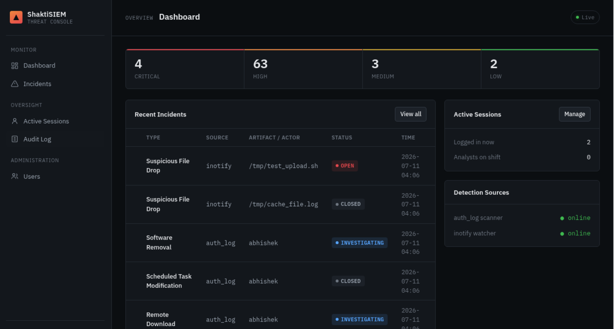
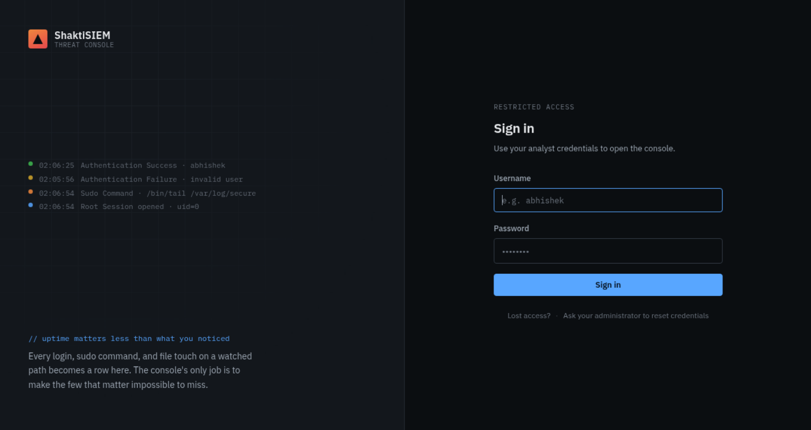
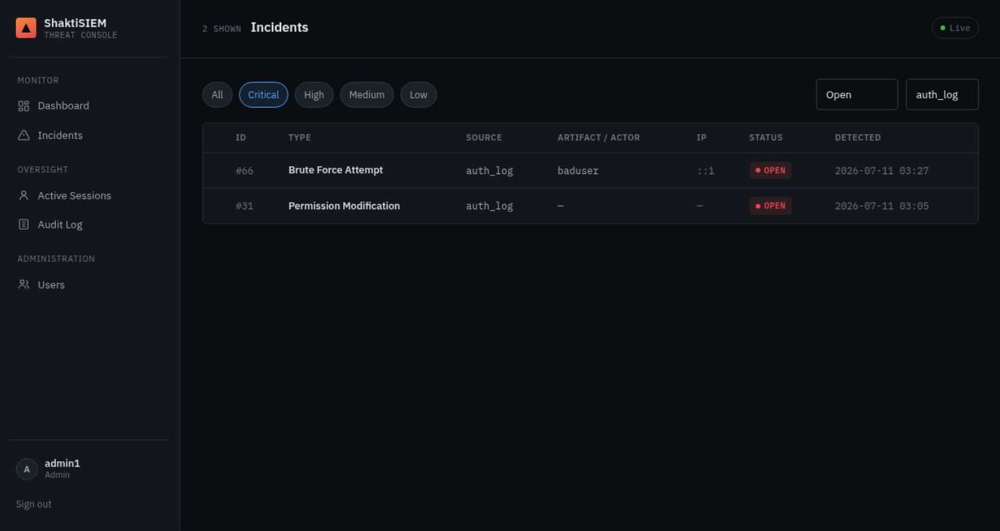
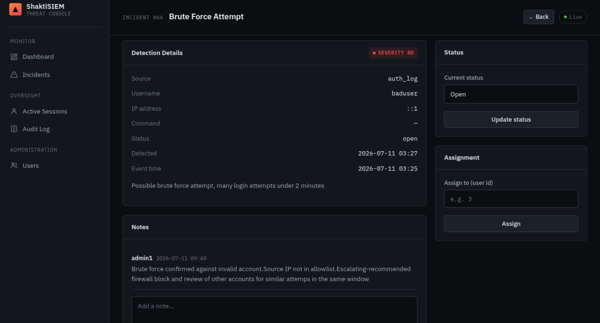
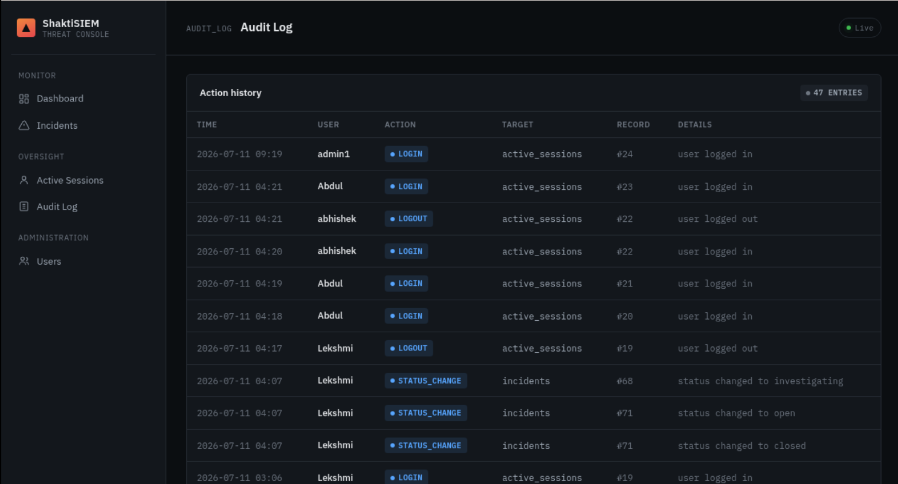

<div align="center">

# 🛡️ ShaktiSIEM

### A lightweight, role-based Security Information & Event Management console


</div>

ShaktiSIEM watches a Linux host for security-relevant events — failed logins, brute-force attempts, sensitive `sudo` commands, and tampering with critical files — and turns each one into a triageable incident in a clean, role-gated web console. Two independent detection engines feed a shared database; the console lets a security team investigate, annotate, assign, and audit every event.



## Features

**Detection**
- `log_parser.py` — parses `/var/log/secure` to detect after-hours logins, brute-force attempts (threshold + time-window based), and sensitive `sudo` commands
- `inotify_monitor.py` — watches critical files and directories (`/etc/passwd`, `/etc/shadow`, `/etc/sudoers`, `/root/.ssh`, and more) in real time via Linux inotify

**Triage & investigation**
- Incident list with combinable filters (severity band, status, source)
- Source-aware detail view (auth events show user/IP/command; file events show artifact/action)
- Threaded notes, status lifecycle (`open → investigating → closed`), and analyst assignment

**Access & oversight**
- Four roles (`admin`, `manager`, `analyst`, `auditor`) enforced server-side on every route, not just hidden in the UI
- Live session management with instant force-logout (validated server-side, not just cookie-cleared)
- Append-only audit log of every status change, assignment, role change, and login/logout
- Soft user deactivation that preserves historical records rather than destroying them

## Screenshots

| Login | Incidents — combined filters |
|---|---|
|  |  |

| Incident detail & triage | Audit log |
|---|---|
|  |  |

## Tech Stack

| Layer | Technology |
|---|---|
| Backend | Python, Flask |
| Database | ShaktiDB (PostgreSQL 17.4-compatible) |
| Auth | bcrypt password hashing, server-side session validation |
| Detection | `inotify_simple` (filesystem events), regex-based log parsing |
| Frontend | Jinja2 templates, hand-written CSS |

## Architecture

```
┌──────────────────┐     ┌──────────────────────┐
│   log_parser.py  │     │  inotify_monitor.py  │
│  (auth log scan) │     │  (filesystem watch)  │
└────────┬─────────┘     └──────────┬───────────┘
         │                          │
         └────────────┬─────────────┘
                      ▼
               ┌──────────────┐
               │   ShaktiDB   │◄────────────┐
               │ (PostgreSQL) │             │
               └──────┬───────┘             │
                      ▼                     │
               ┌──────────────┐             │
               │    app.py    │─────────────┘
               │  (Flask app) │
               └──────┬───────┘
                      ▼
             Role-gated web console
```

The detection engines and the web app are independent processes communicating only through the shared database — the console reads what the engines write, so either side can restart or fail without affecting the other.

## Role Permissions

| Action | Analyst | Manager | Admin | Auditor |
|---|:---:|:---:|:---:|:---:|
| View dashboard & incidents | ✅ | ✅ | ✅ | ✅ |
| Add notes / change status | ✅ | ✅ | ✅ | ❌ |
| Assign incidents | ❌ | ✅ | ✅ | ❌ |
| View active sessions | ❌ | ✅ | ✅ | ✅ |
| Force-logout a session | ❌ | ✅ | ✅ | ❌ |
| View audit log | ❌ | ❌ | ✅ | ✅ |
| Manage users | ❌ | ❌ | ✅ | ❌ |

## Getting Started

**Prerequisites:** Python 3.9+, a running PostgreSQL-compatible ShaktiDB instance, and Linux (required for `inotify_monitor.py`).

```bash
# 1. Clone & install
git clone https://github.com/<your-username>/ShaktiSIEM.git
cd ShaktiSIEM
pip install -r requirements.txt
```

Create a `password.env` file in the project root (gitignored — never committed):

```env
DB_HOST=127.0.0.1
DB_PORT=5432
DB_NAME=shaktisiem
DB_USER=your_db_user
DB_PASSWORD=your_db_password
SECRET_KEY=generate_a_long_random_string_here
```

```bash
# 2. Set up the database
psql -h 127.0.0.1 -U <db_user> -d shaktisiem -f scripts/audit_table.sql
psql -h 127.0.0.1 -U <db_user> -d shaktisiem -f scripts/add_is_active_to_users.sql

# 3. Create your first admin user
python3 scripts/create_admin.py

# 4. Run the console
python3 app.py            # then visit http://localhost:5000/login

# 5. Run the detection engines (separate terminals, need root)
sudo python3 inotify_monitor.py   # continuous — watches files in real time
sudo python3 log_parser.py        # single pass — schedule via cron
```

## Project Structure

```
ShaktiSIEM/
├── app.py                  # Flask routes, auth, RBAC decorators
├── db.py                   # All database queries
├── auth.py                 # Password hashing / verification
├── log_parser.py           # Auth-log detection engine
├── inotify_monitor.py      # Filesystem-watch detection engine
├── templates/              # Jinja2 templates
├── static/css/             # Stylesheet
├── scripts/                # Setup scripts & SQL migrations
└── docs/screenshots/       # README images
```

## Why ShaktiDB

ShaktiSIEM runs on [ShaktiDB](https://shaktidb.iitmpravartak.net/), an indigenous PostgreSQL-compatible database platform developed by IITM Pravartak and C-DAC. Because it's fully PostgreSQL-compatible, the data layer runs unchanged on either — the choice reflects ShaktiDB's compliance and sovereignty positioning (alignment with RBI, Cert-In, and CCRA standards), which pairs naturally with a security tool.

## Roadmap

- [ ] Pagination for incidents at scale
- [ ] Retention / archival policy for old closed incidents
- [ ] Email / webhook alerting on critical incidents
- [ ] Dashboard charts (incidents over time)

## License

MIT — see [LICENSE](LICENSE).

## Author

Built by **Abhishek Nair J** — a hands-on project exploring Python, Flask, PostgreSQL/ShaktiDB, and security-operations concepts.
